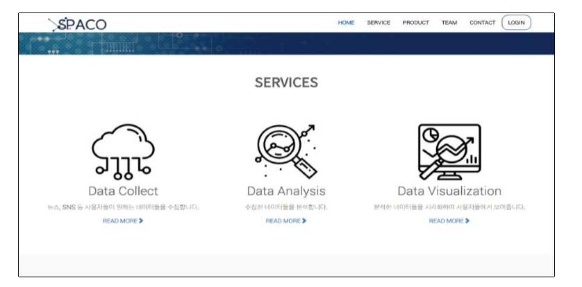
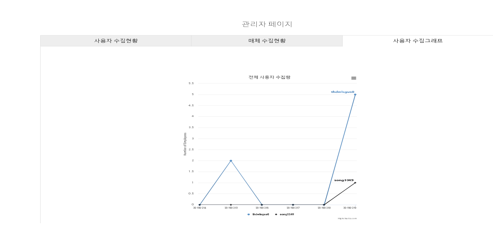
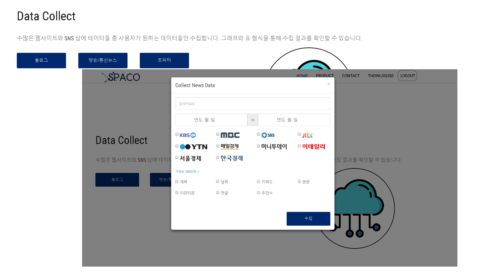
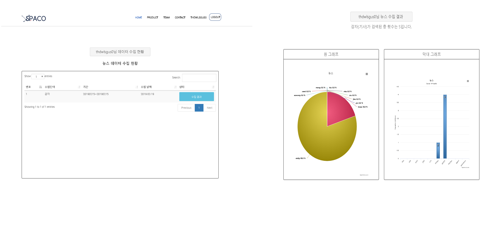

# vege_table

## 농기평 데이터 수집기 프로젝트

 기능은 다음과 같습니다.

1.  네이버뉴스와 다음뉴스의 뉴스매체에서 데이터 수집 가능.
2.  수집되는 데이터는 제목, 본문, 날짜를 선택해서 수집할 수 있음.
3.  수집된 후에 수집현황을 원그래프와 점그래프로 보여줄 수 있음.
4.  사용자는 로그인과 회원가입을 진행할 수 있음.
5.  관리자페이지가 따로 있어서 사용자들이 수집한 정보들을 관리할 수 있음

* 데이터 수집/ 분석/ 시각화 선택 가능

* 시각화기능

* 관리자 기능

* 수집 창

* 수집 결과 창 

